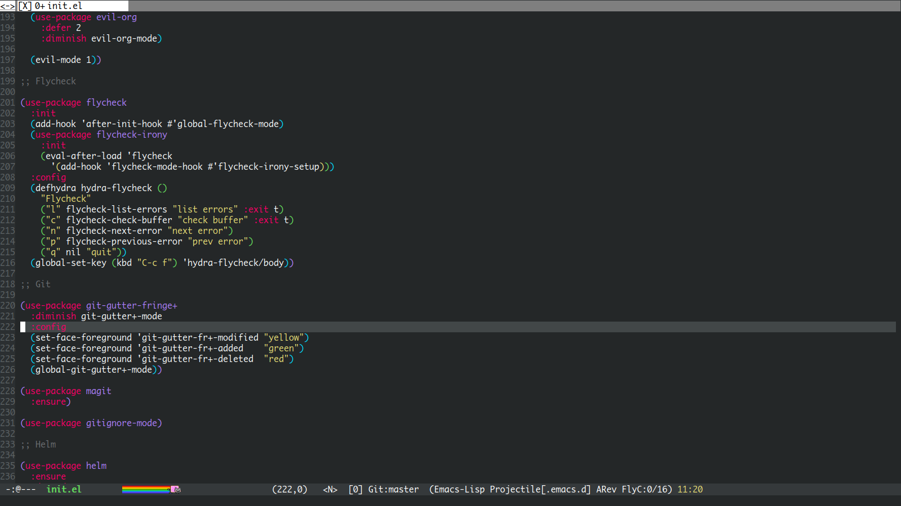

dotemacs
========

My emacs config.

Plugins
-------

Theme: ujelly

 * company
 * company-irony
 * company-irony-c-headers
 * company-jedi
 * elscreen
 * emmet-mode
 * evil
 * evil-leader
 * evil-surround
 * evil-tabs
 * evil-vimish-fold
 * flycheck
 * flycheck-irony
 * ggtags
 * git-gutter-fringe+
 * helm
 * helm-flx
 * helm-projectile
 * highlight-symbol
 * irony
 * java-file-create
 * java-snippets
 * jdee
 * jedi-core
 * js2-mode
 * libmpdee
 * magit
 * markdown-mode
 * nlinum
 * projectile
 * rainbow-mode
 * smartparens
 * ujelly-theme
 * use-package
 * vimish-fold
 * vimrc-mode
 * web-mode
 * yasnippet

Picture
-------

